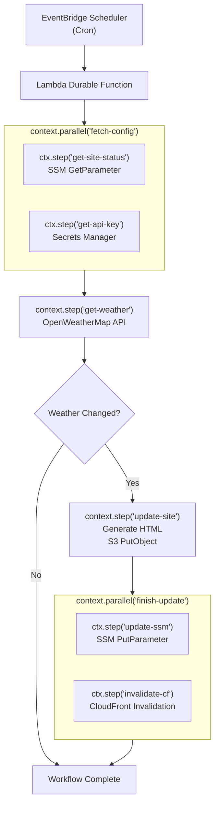

# Durable Function Weather Site

A Lambda Durable Function version of the [weather-site](https://github.com/deeheber/weather-site) Step Function project. Built as an example to compare the two approaches. See the [accompanying blog post](https://danielleheberling.xyz/blog/durable-functions/) for a detailed comparison.

## 🤔 What is this?

The original [weather-site](https://github.com/deeheber/weather-site) uses an **AWS Step Function** to orchestrate a weather-checking workflow: check current weather via the OpenWeatherMap API, and update a static S3 website to say whether it's snowing (or raining, etc.) in a given location.

This project implements the **same workflow** using [Lambda Durable Functions](https://docs.aws.amazon.com/lambda/latest/dg/durable-functions.html), released at AWS re:Invent 2025.

## ⚖️ Step Functions vs Durable Functions

| Concept             | Step Functions                         | Durable Functions                        |
| ------------------- | -------------------------------------- | ---------------------------------------- |
| Workflow definition | JSON/YAML state machine (ASL)          | Plain TypeScript code                    |
| State management    | Managed by service                     | Automatic checkpointing via SDK          |
| Service calls       | `CallAwsService` task                  | AWS SDK calls inside `ctx.step()`        |
| HTTP calls          | `HttpInvoke` task + Connection         | `fetch()` inside `ctx.step()`            |
| Conditional logic   | `Choice` state with JSONata            | Plain `if` statement                     |
| Parallel execution  | `Parallel` state                       | `ctx.parallel([...])`                    |
| Separate Lambda     | `LambdaInvoke` task                    | Inlined as a step (no separate function) |
| Scheduling          | EventBridge Scheduler -> Step Function | EventBridge Scheduler -> Lambda          |
| Infrastructure      | State Machine + Connection + Lambda    | Single Lambda function                   |

## 🏗️ Architecture

```
EventBridge Scheduler (cron)
  -> Lambda Durable Function
      -> ctx.step('get-site-status')     // SSM GetParameter
      -> ctx.step('get-api-key')         // Secrets Manager
      -> ctx.step('get-weather')         // fetch() OpenWeatherMap API
      -> if (weather !== siteStatus)
          -> ctx.step('update-site')     // Generate HTML, S3 PutObject
          -> ctx.parallel([
              ctx.step('update-ssm'),    // SSM PutParameter
              ctx.step('invalidate-cf')  // CloudFront CreateInvalidation
             ])
```



## 🛠️ Technologies

- **Runtime**: Node.js 24, TypeScript
- **Infrastructure**: AWS CDK v2 (TypeScript)
- **AWS Services**: Lambda (Durable Functions), S3, CloudFront, SSM Parameter Store, Secrets Manager, EventBridge Scheduler
- **Weather API**: [OpenWeatherMap One Call API 3.0](https://openweathermap.org/api/one-call-3)

## 🚀 Getting Started

See [DEPLOYMENT.md](DEPLOYMENT.md) for setup and deployment instructions.
